# EUU环境搭建与测试

## 一、准备工作(以Windows 10平台为例)

* `Keil 5 for Arm`(测试版本MDK527)
* `ARM CMSIS`(测试版本4.5.0)
* `NordicSemiconductor.nRF_DeviceFamilyPack`（测试版本8.17.0）
* `Nordic nRF52832`芯片

### 1、安装并激活Keil

**注意：未激活的Keil有编译代码大小的限制，可能无法完成编译工作。**

### 2、安装`ARM CMSIS`和`NordicSemiconductor.nRF_DeviceFamilyPack`

直接双击安装文件，按照提示即可完成安装。

## 二、EUU结构描述

EUU文件夹下的`software`目录中共有两个版本的工程项目，分别对应`Beacon`协议和Nordic自研的`ESB`通信协议。

以`Beacon`版本为例，在`beacon_version`目录下的文件组织形式与Nordic官方提供的`SDK`例程的组织形式类似。由于本项目使用的芯片是`52832`，所以其对应的`Keil`的启动文件在路径`ViPSN\EUU\software\beacon_version\examples\ble_peripheral\ble_app_beacon\pca10040\s132\arm5_no_packs`下面。

## 三、Keil工程编译

双击打开该`Keil`工程，此时可能会遇到`CMSIS`、`DeviceFamilyPack`缺失的信息，由于前面在安装`Keil`的时候已经安装了相应的文件，所以这里我们选择`否`取消安装。这时，在`Keil`的左侧项目视图中，最下面的`CMSIS`以及`Device`显示是红色，编译工程也会出现错误。

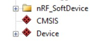

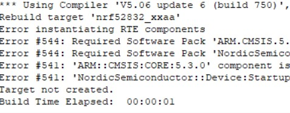

这时，选择`Keil`上方工具栏中的`Select Software Packs for Target XX`选项卡，在弹出的界面中展开`CMSIS`和`Device Family Pack`选项，取消标红的版本，相应选择刚刚我们自己安装的版本。

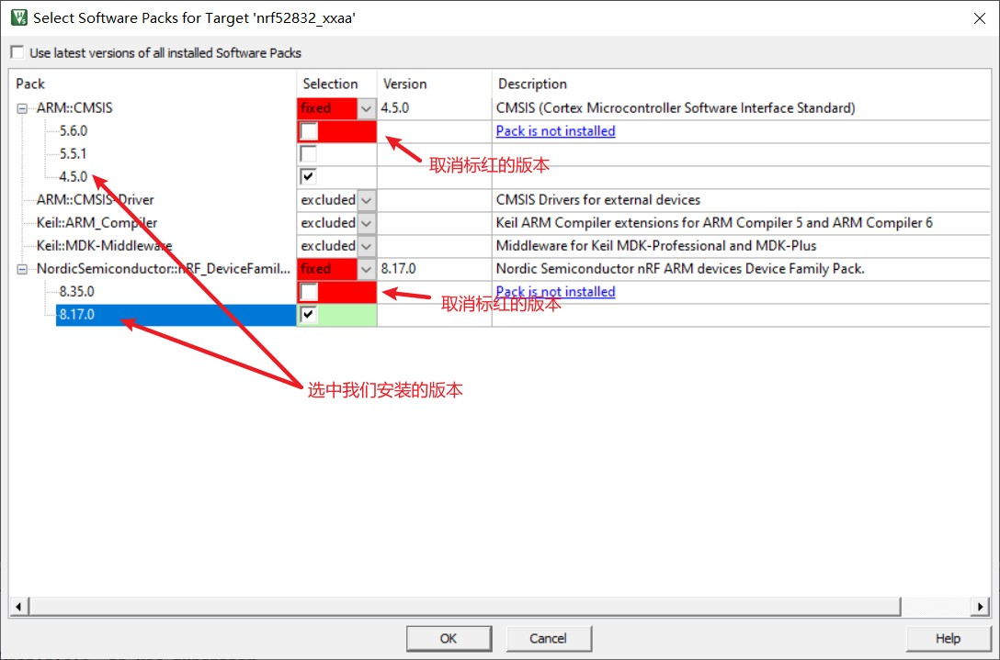

确定后在弹出的新对话框中，同样展开`CMSIS`以及`Device`选项卡，将标红的版本对应的勾取消。

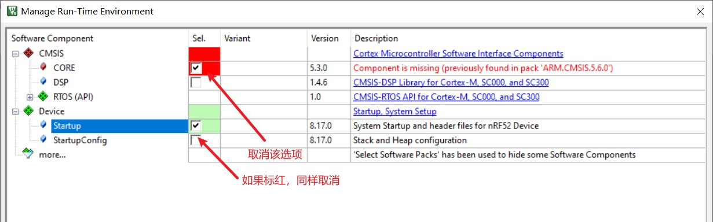

取消后点击确定关闭该对话框。此时在主界面中，取消的内容会变成灰色。这时进入选项卡`Manage Run-Time Environment`，对应的版本就会更新，按照下图在相应位置前选择即可。

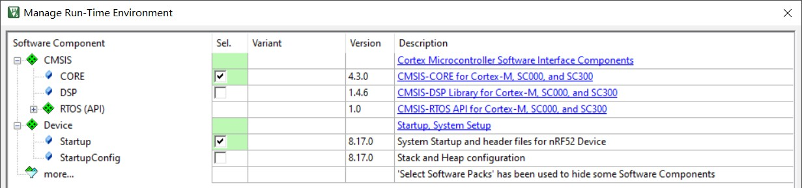

这时，所有编译前的准备工作完成，选择`Build`选项，即可完成编译。

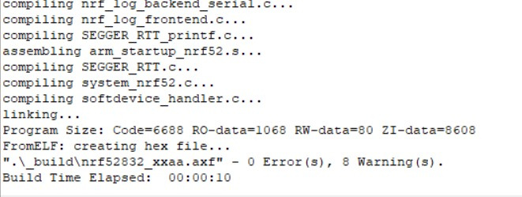

另外，注意每个项目都会有两个Target，分别对应应用程序和协议栈，其中，应用程序无需再进行额外的操作，可以正常选择`Build`以及`Download`选项。

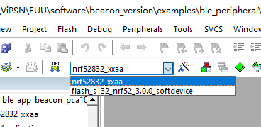

但是协议栈Target想要进行`Build`以及`Download`选项则需要注意以下几点：
如果协议栈Target无法成功`Build`，可参考以下方法

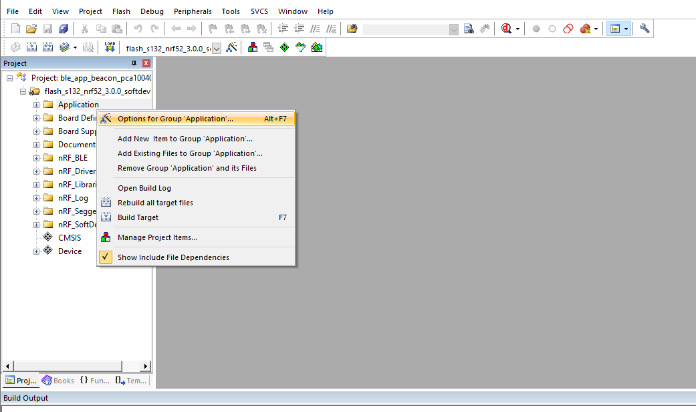

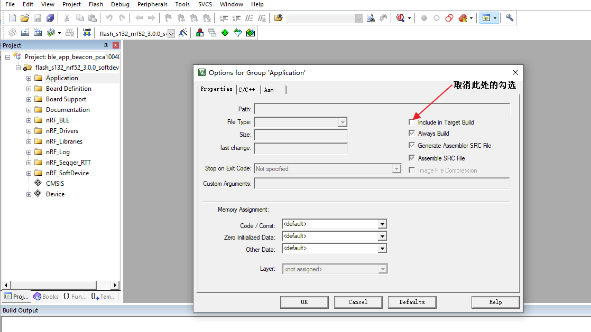

对协议栈下所有文件都进行此操作

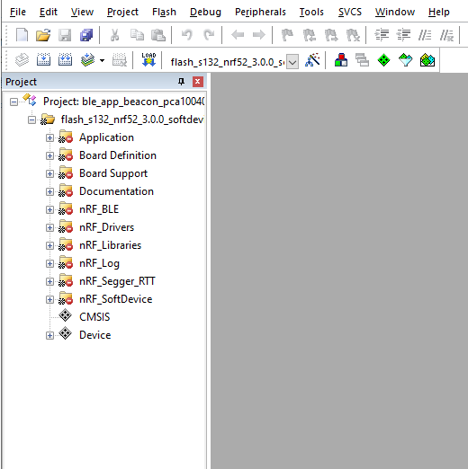

如果协议栈Target无法成功`Download`，并出现如下报错

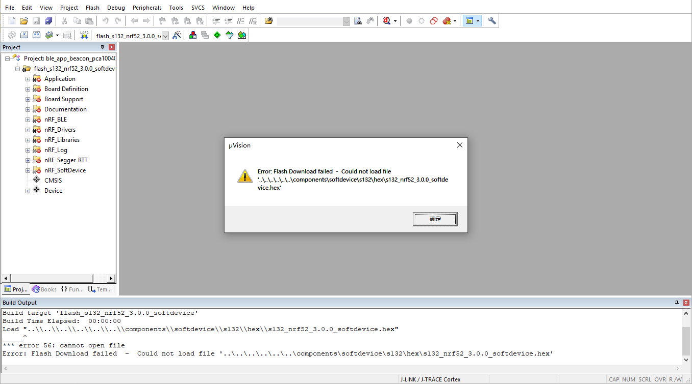

这是由于在未按上述步骤操作，直接进行`Build`选项后，协议栈内的.hex文件会被删除，从而无法成功进行`Download`。可选择通过手动添加该协议栈的.hex文件解决报错。

最后是关于对于同一个项目，在`Keil`中进行`Erase`后无法再成功`Download`的情况，报错如下

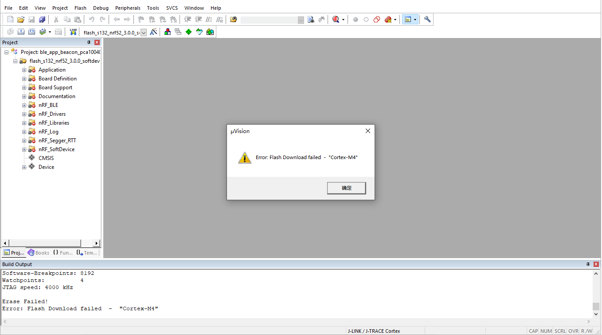

这是由于在同一个协议栈Target下，`Erase`操作无法进行完全，可以通过用`Keil`打开另一个不同版本的`Nordic SDK`项目，在另一个不同名的协议栈下进行`Erase`操作，便可完全擦除。再次`Download`之前的协议栈便不会有此报错。

## 注意

本项目默认使用`J-Link`下载代码到芯片，`Keil`同样支持使用`ST-Link`完成下载，但是请在下载前将`Debug`配置从`J-Link`换成`ST-Link`。